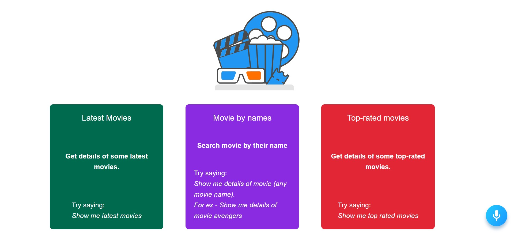
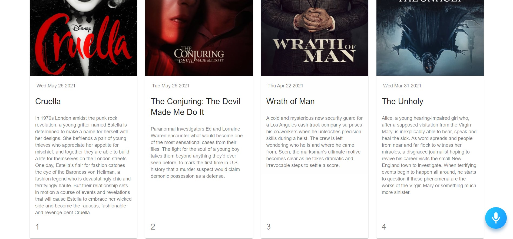

# Smart Movie DB ( https://smart-moviedb.netlify.app/ )

## Voice Controlled Movie Database Application.

You can get movie details through voice commands.

- Get list of latest movies 
- Get details of particular searched movie 
- Get details of top-rated movies

I have used [Alan AI](https://alan.app/) as voice assistant.  
[Alan Studio Source Code](https://gist.github.com/aviraltandon21/1da518c34fd21f9ff0234cfedde38f7d)

## Preview Images

### Home Page - 
 

  

### Command -> 'Show me latest movies'
 

  

### Some additional functionalities - 

- You can ask Alan AI to read the movie titles along with their release dates.
- While reading titles , it will automatically scroll the page for you.
- You can ask him to go back by saying <i>'Go Back'</i>
